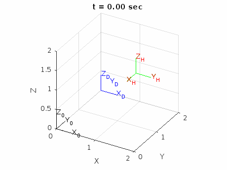

# Robotics
Project for the course **Robotics**, 2024-25 ECE AUTH  

## Objective
The goal of this project is to design and control a robot (UR10) to manipulate a door handle
and open a door, following a planned trajectory while ensuring smooth motion and
precise timing.  
**Part A:** Design a position-and-orientation trajectory for the handle {H} with zero
initial and final velocity and acceleration, enabling the door to open in 5 seconds.  
**Part B:** Design appropriate joint velocity commands so that the robot moves the handle
according to the trajectory planned in Part A and opens the door within T = 5 seconds,
using a sampling period of t_s = 0.01 seconds  

## Tools & Technologies
- **Programming Languages:** MATLAB
- **Other Tools:** [Robotic ToolBox for Matlab](https://github.com/petercorke/robotics-toolbox-matlab) (Peter Corke)

## Results   
### Part A  
  

### Part B

